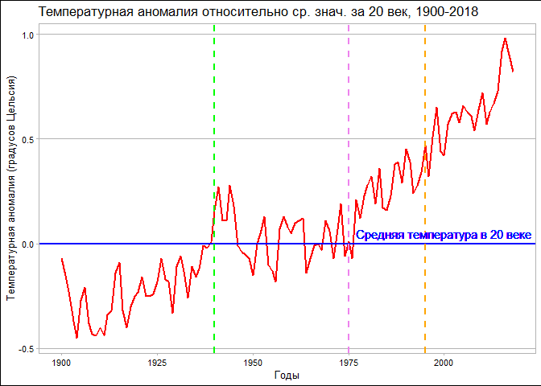
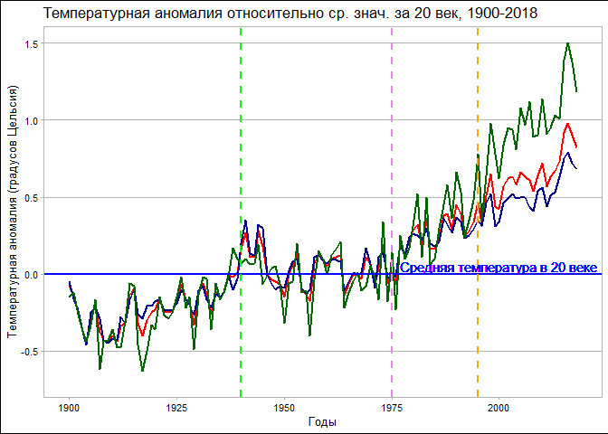
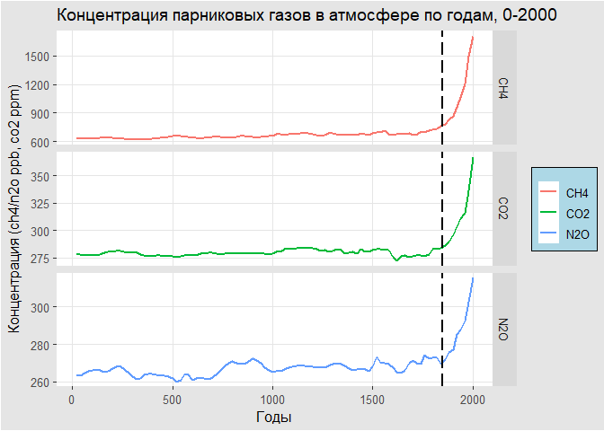
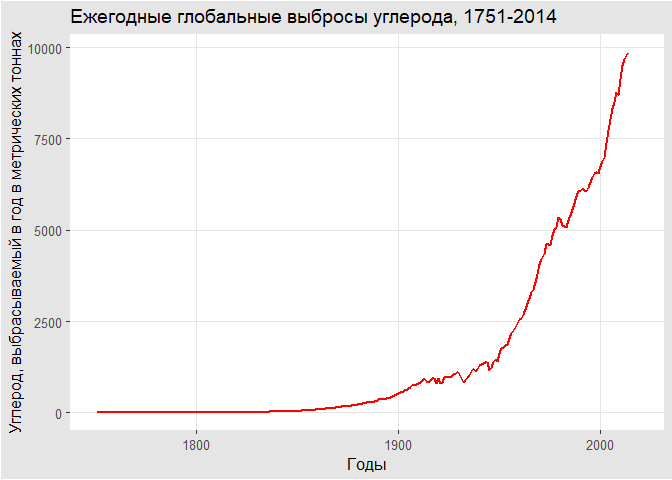
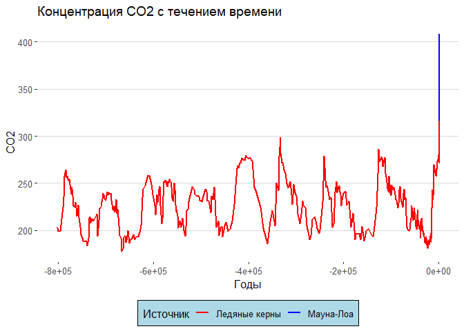
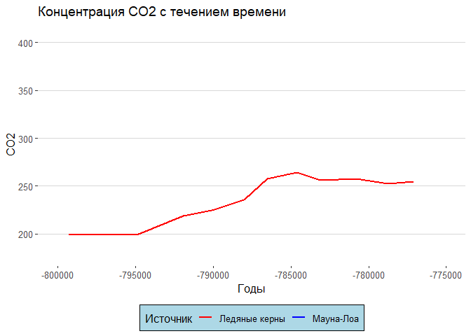
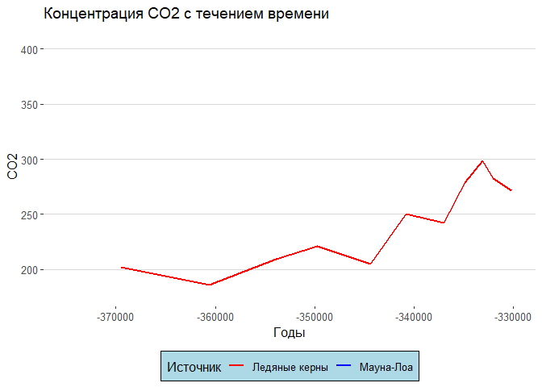
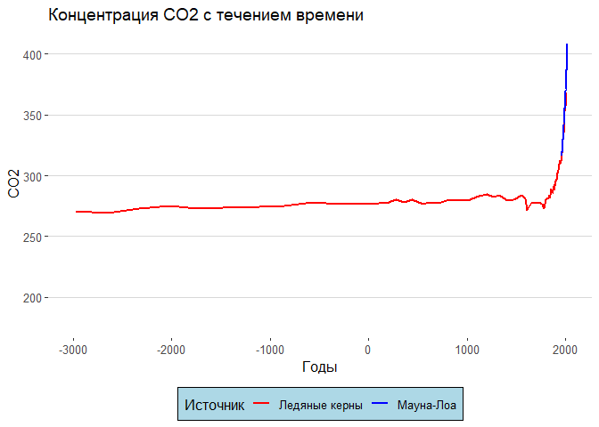

Вклад человека в изменение климата
================
Denis
10 02 2022

## Введение

Визуализация изменений климата Исследование взаимосвязи между
глоабльными температурными изменениями, парниковыми газами и выбросами
углерода человеком, используя временные графики на базе фактических
измерений ледяного керна и атмосферных данных Национального управления
океанических и атмосферных исследований (NOAA), а также
Информационно-аналитического центра углекислого газа (CDIAC).

Следующие бибилиотеки были использованы:

``` r
library(tidyverse)
library(dslabs)
library(ggthemes)
```

и данные:

``` r
data(temp_carbon)
data(greenhouse_gases)
data(historic_co2)
```

# 1. График временного ряда температурной аномалии.

Синяя горизонтальная линия показывает среднюю температуру в 20 веке
Зеленая прерывистая вертикальная линия - первый год, когда температура
превысила ср.значение 20 века (1940 г.). Фиолетовая прерывистая
вертикальная линия - последний год с температурой ниже ср.значения 20
века (1975 г.). Оранжевая прерывистая вертикальная линия - температурная
аномалия превысила 0.5 градуса Цельсия в первый раз (1995 г.).

    ## Warning: Removed 20 row(s) containing missing values (geom_path).

<!-- -->

# 2. Добавляем график температурной аномалии в океане (темно-синяя линия) и на земле (темно-зеленая линия).

На земле наблюдается наибольшая температурная аномалия в 2018 г. по
сравнению со средним значением 20-го века. Кроме того на земле произошло
самое большое изменение температуры с 1900 года.

    ## Warning: Removed 20 row(s) containing missing values (geom_path).

    ## Warning: Removed 20 row(s) containing missing values (geom_path).

    ## Warning: Removed 20 row(s) containing missing values (geom_path).

<!-- -->

# 3. График концентрации парниковых газов по годам.

Пунктирная вертикальная линия - неофициальное начало промышленной
революции (1850 г.)  
и повсеместного использования ископаемого топлива. Ед.измерения для
углекислого газа (co2) - частей на миллион (ppm), для метана (ch4) и
оксида азота(n2o) - частей на миллиард (ppb).

<!-- -->

# 4. График временного ряда выбросов углерода.

Ось у - углерод, выбрасываемый в год в метрических тоннах.

    ## Warning: Removed 4 row(s) containing missing values (geom_path).

<!-- -->

# 5. График концентрации СО2 с течением времени на основании непосредственных измерения концентрации co2 в атмосфере в Мауна-Лоа с 1959 г., а также косвенные измерения концентрации co2 в атмосфере в ледяных кернах возрастом 800 000 лет.

Выводы: Современный уровень СО2 выше, чем когда-либо за последние 800
000 лет. Существуют естественные циклы увеличения и уменьшения СО2,
длящиеся 50 000-100 000 лет за цикл. В большинстве случаев для снижения
уровня СО2 требуется больше времени, чем для его повышения.

<!-- -->

# 6. Графики аномального, даже взрывного роста концентрации CO2

Для примера возьмем временной интервал от -800 000 до -775 000 лет. 10
000 лет потребовалось co2, чтобы вырасти с 200 ppmv до 275 ppmv

    ## Warning: Removed 683 row(s) containing missing values (geom_path).

<!-- -->

Возьмем временной интервал от -375 000 до -330 000. 25 000 лет
потребовалось co2, чтобы вырасти со 180 ppmv до 300 ppmv

    ## Warning: Removed 683 row(s) containing missing values (geom_path).

<!-- -->

Возьмем современный временной интервал от -3000 до 2018 г. 250 лет
потребовалось co2, чтобы вырасти со своего стабильного уровня 275 ppmv
до текущего уровня 400 ppmv.

    ## Warning: Removed 539 row(s) containing missing values (geom_path).

<!-- -->
